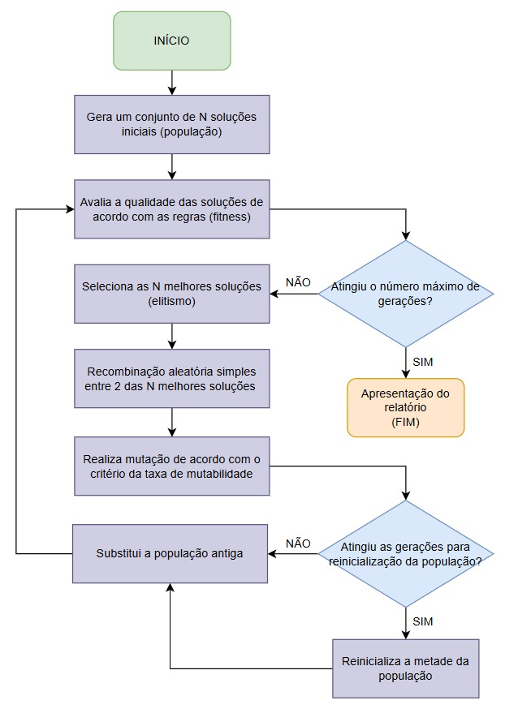
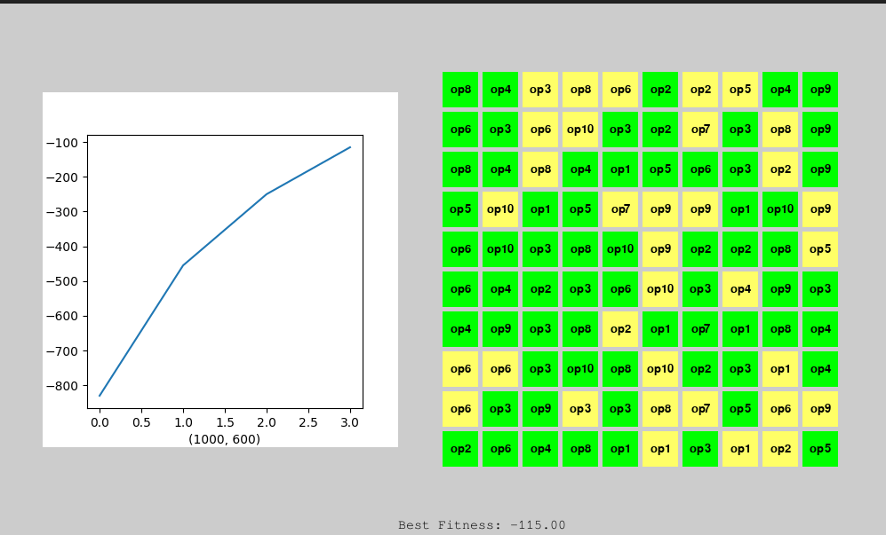

# Tech Challenge - Pós-Tech SOAT - FIAP - Fase 2

Alunos:

* André Mattos - RM358905
* Aurelio Thomasi Jr - RM358104
* Leonardo Ramires - RM358190
* Lucas Arruda - RM358628
* Pedro Marins - RM356883

## Evidências do projeto
- [Link para o repositório](https://github.com/leonardoramires/fiap-ia4devs)
- [Link para o vídeo do projeto]()

## Como rodar o projeto

1. Clonar o repositório
   ```bash
   git clone https://github.com/leonardoramires/fiap-ia4devs.git
   ```
2. Instalar as dependências
   ```bash
   pip install -r fase2/requirements.txt
   ```
3. Rodar o projeto
   ```bash
   python fase2/main.py
   ```

> **Sobre instalação das dependências**: É recomendável utilizar o ambiente virtual do Python para instalar as dependências, utilizando o comando `python -m venv .venv` e depois ativar o ambiente virtual com o comando `source .venv/bin/activate`.

## Definição do Problema
O problema consiste em alocar ordens de serviço (OS) de manutenção para operadores de forma otimizada, considerando as habilidades necessárias para cada ordem e as habilidades dos operadores disponíveis. 
O problema a ser resolvido é maximizar a produtividade operacional, assegurando o cumprimento dos prazos estabelecidos, evitar horas extras desnecessárias e garantir que as ordens sejam atendidas dentro do prazo estipulado.

## Objetivos
O projeto aborda o desafio crítico de otimização na alocação de ordens de serviço (OS) de manutenção. Através de um algoritmo especializado, o sistema realiza o pareamento preciso entre as competências técnicas dos operadores e as exigências específicas de cada ordem.

Alocar ordens de serviço de forma eficiente, maximizando a compatibilidade entre as habilidades dos operadores e as habilidades necessárias para as ordens.
Minimizar o número de horas extras trabalhadas pelos operadores.
Garantir que as ordens de maior prioridade sejam atendidas dentro do prazo.

## O Projeto


*Figura 1: Fluxograma Genérico do Algoritmo Genético*

Este projeto foi desenvolvido utilizando um algoritmo genético para otimizar a alocação de ordens de serviço aos operadores. As seguintes informações relevantes sobre as ordens e operadores são utilizadas para a otimização:

- **Dados das ordens**: Incluem o tempo estimado de execução, habilidades necessárias, prioridade, status, e o dia esperado de início do atendimento.
- **Dados dos operadores**: Contêm as habilidades disponíveis, nível de qualificação e horas disponíveis.

Abaixo estão os pontos essenciais desta solução, com os principais detalhes:

### 1. Reajuste nas Funções de Aptidão
- ✨ Adição de pesos considerando a prioridade da OS
- 📊 Penalização proporcional por horas extras

### 2. Otimização do Crossover
- 🔄 Garantia de atribuição única para cada ordem
- 📉 Redução de soluções inviáveis
- 📈 Melhoria na qualidade das soluções

### 3. Processo de Mutação Inteligente
- 🧬 Verificação da qualidade pós-mutação
- ↩️ Reversão automática de mutações prejudiciais

### 4. Sistema de Elitismo
- 🏆 Preservação dos melhores indivíduos (5 melhores)
- 📈 Manutenção de soluções de alta qualidade entre gerações

### 5. Gestão Populacional
- 🔄 Reinicialização parcial periódica (metade da população)
- 🎯 Prevenção de convergência prematura para uma solução subótima

### 6. Controle de Qualificação
- ✅ Exigência mínima de 50% das habilidades necessárias
- 🚫 Prevenção de alocações inadequadas

## Detalhamento do Algoritmo Genético

### 1. Geração da População Inicial 🌱
A população inicial consiste em um conjunto de soluções (indivíduos) geradas aleatoriamente, onde cada solução representa uma possível alocação de ordens de serviço ao longo do período de 5 dias.
Também existe uma opção de gerar a população inicial com base em uma solução pré-definida, que é a solução encontrada pelo algoritmo genético da fase 1.

#### Processo de Geração:
- **Distribuição Aleatória**: As ordens são distribuídas entre operadores e dias
- **Validação de Habilidades**: Garantia de compatibilidade entre operador e ordem
- **Estrutura**: `{dia: {operador_id: [ordem_ids]}}`

### 2. Processo de Seleção 🎯
Utilizamos o método de torneio para selecionar as soluções (pais) que gerarão a próxima geração.

#### Etapas do Torneio:
1. Seleção aleatória de um grupo de soluções
2. Avaliação da aptidão de cada solução
3. Escolha da melhor solução como pai
4. Repetição até atingir o número necessário de pais

### 3. Processo de Crossover 🔄
O crossover combina duas soluções (pais) para gerar uma nova solução (filho).

#### Metodologia:
1. **Seleção do Ponto**: 
   - Escolha aleatória do ponto de divisão
   - Exemplo: Em 5 dias, ponto 2 = dias [1-2] + [3-5]

2. **Combinação**:
   - Primeiro segmento do pai 1
   - Segundo segmento do pai 2
   - Garantia de atribuição única para cada ordem

### 4. Processo de Mutação 🧬
A mutação introduz variações nas soluções para manter a diversidade genética.

#### Procedimento:
1. **Verificação**: Probabilidade de mutação por dia
2. **Execução**: 
   - Seleção de dois operadores no mesmo dia
   - Troca de ordens entre eles
3. **Validação**: 
   - Avaliação pré e pós-mutação
   - Reversão se não houver melhoria

### 5. Função de Aptidão ⚖️
Avalia a qualidade das soluções considerando múltiplos critérios.

#### Critérios de Avaliação:
1. **Compatibilidade de Habilidades**:
   - Pontuação positiva para matches
   - Penalidades para incompatibilidades

2. **Gestão de Prazos**:
   - Verificação de conclusão no prazo
   - Penalidades proporcionais a atrasos e prioridades

3. **Controle de Horas**:
   - Monitoramento de horas por operador
   - Penalização por excesso

### 6. Fluxo do Algoritmo 🔄
1. **Inicialização**:
   - Geração da população inicial

2. **Ciclo Evolutivo**:
   - Cálculo de aptidão
   - Seleção por torneio
   - Crossover
   - Mutação
   - Elitismo
   - Reinicialização parcial periódica

3. **Finalização**:
   - Seleção da melhor solução
   - Conversão para DataFrame

### 7. Relatório com PyGame 🎮


*Figura 2: Relatório com PyGame*

Este relatório foi gerado utilizando a biblioteca PyGame, que é uma biblioteca Python para criação de jogos e simulações. O relatório é responsável por exibir o resultado do algoritmo genético de forma visual, mostrando a alocação das ordens de serviço aos operadores ao longo do período de 5 dias, em formato de um calendário.

## Informações gerais sobre o resultado do algoritmo
A análise dos resultados do algoritmo genético para alocação de ordens de serviço de manutenção revela aspectos importantes sobre sua performance e limitações. O algoritmo foi desenvolvido para otimizar a distribuição de 100 ordens de serviço entre 15 operadores ao longo de 5 dias, considerando múltiplas variáveis como habilidades técnicas, prioridades e prazos.

### 1. 🔄 Comparação com outros algoritmos
Outros algoritmos foram utilizados por ordem de realizar a comparação, como o algoritmo guloso, o algoritmo de programação linear e a alocação humana.
Esta comparação foi realizada com base no fitness das soluções encontradas pelos algoritmos, que é uma medida da qualidade da solução encontrada. O resultado desta comparação pode ser visto na seção 📊 Estatísticas gerais do algoritmo.

### 2. 📊 Estatísticas gerais do algoritmo

#### Informações gerais sobre as ordens:
| Métrica | Valor |
|---------|-------|
| Total de Ordens | 100 |
| Ordens Alocadas | 85 (85.0%) |
| Ordens Não Alocadas | 15 |

O algoritmo conseguiu alocar 85% das ordens de serviço.

#### Análise por prioridade:
| Prioridade | Quantidade | Percentual |
|------------|------------|------------|
| Urgente | 20 | 23.5% |
| Alta | 29 | 34.1% |
| Média | 24 | 28.2% |
| Baixa | 12 | 14.1% |

#### Ordens não alocadas:
Neste caso, o algoritmo não conseguiu alocar 15 ordens de serviço.

#### Comparação de Fitness entre os algoritmos
| Algoritmo | Fitness |
|-----------|---------|
| Greedy Algorithm | 400.0 |
| Linear Programming | -1005.0 |
| Alocação Humana | 615.0 |
| Genetic Algorithm | 1095.0 |

Como podemos ver, o algoritmo genético foi o que obteve o melhor resultado, seguido pela alocação humana.

#### Distribuição por dia
Resumo das ordens alocadas por dia:

| Dia | Total de Ordens | Horas Alocadas | Urgente | Alta | Média | Baixa |
|-----|----------------|----------------|----------|------|-------|-------|
| 1 | 18 | 80.0h | 17 | 1 | 0 | 0 |
| 2 | 18 | 80.0h | 3 | 14 | 1 | 0 |
| 3 | 16 | 76.0h | 0 | 14 | 2 | 0 |
| 4 | 18 | 80.0h | 0 | 0 | 15 | 3 |
| 5 | 15 | 76.0h | 0 | 0 | 6 | 9 |

### Dados dos operadores
| operator_id | skills | level | shift | hours_per_day |
|------------|--------|-------|-------|---------------|
| op1 | pintura \| elétrica \| solda | sênior | manhã | 7 |
| op2 | elétrica \| pintura \| alvenaria | júnior | manhã | 7 |
| op3 | pintura \| elétrica \| hidráulica | sênior | noite | 7 |
| op4 | pintura \| alvenaria \| elétrica | pleno | tarde | 9 |
| op5 | pintura \| hidráulica | pleno | tarde | 9 |
| op6 | solda \| hidráulica | especialista | tarde | 7 |
| op7 | pintura \| elétrica \| alvenaria | júnior | tarde | 9 |
| op8 | elétrica \| pintura \| solda | sênior | tarde | 7 |
| op9 | pintura \| solda | júnior | tarde | 8 |
| op10 | solda \| elétrica \| pintura | pleno | manhã | 9 |
| op11 | elétrica \| alvenaria \| solda | sênior | manhã | 7 |
| op12 | hidráulica \| alvenaria | sênior | noite | 9 |
| op13 | hidráulica \| solda | júnior | tarde | 8 |
| op14 | solda \| elétrica | especialista | manhã | 8 |
| op15 | alvenaria \| elétrica \| hidráulica | especialista | manhã | 9 |

### Dados das ordens
| id_ordem | Serviços | horas_estimadas | prioridade | inicio_esperado | status |
|----------|----------|-----------------|------------|-----------------|---------|
| os1 | elétrica | 5 | média | 4 | não_atendida |
| os2 | hidráulica | 8 | alta | 1 | não_atendida |
| os3 | hidráulica \| pintura | 5 | média | 2 | não_atendida |
| os4 | hidráulica | 7 | baixa | 2 | não_atendida |
| os5 | alvenaria | 2 | alta | 4 | não_atendida |
| os96 | solda \| pintura | 8 | baixa | 5 | não_atendida |
| os97 | solda \| hidráulica | 2 | urgente | 1 | não_atendida |
| os98 | hidráulica | 5 | média | 5 | não_atendida |
| os99 | elétrica | 2 | alta | 1 | não_atendida |
| os100 | hidráulica | 3 | média | 5 | não_atendida |

[100 rows x 6 columns]

### Dados das ordens atribuídas aos operdores (shape = (100, 17))
| dia | id_ordem | id_operador | Serviços | compatibilidade_prioridade | hora_extra | total_hora_extra | status |
|-----|----------|-------------|-----------|---------------------------|------------|------------------|---------|
| 4 | os22 | op1 | solda \| pintura | OK | Não | -2 | atendida |
| 1 | os36 | op1 | elétrica | OK | Não | -3 | atendida |
| 1 | os49 | op1 | elétrica | OK | Sim | 2 | atendida |
| 5 | os55 | op1 | pintura \| solda | OK | Não | 0 | atendida |
| 2 | os68 | op1 | elétrica | OK | Sim | 1 | atendida |
| ... | ... | ... | ... | ... | ... | ... | ... |
| 2 | os30 | op9 | hidráulica \| pintura | OK | Não | 0 | atendida |
| 1 | os48 | op9 | solda | OK | Não | -6 | atendida |
| 3 | os78 | op9 | solda | OK | Não | -1 | atendida |
| 1 | os90 | op9 | alvenaria \| solda | NOK | Não | -1 | atendida |
| 4 | os96 | op9 | solda \| pintura | OK | Não | 0 | atendida |
