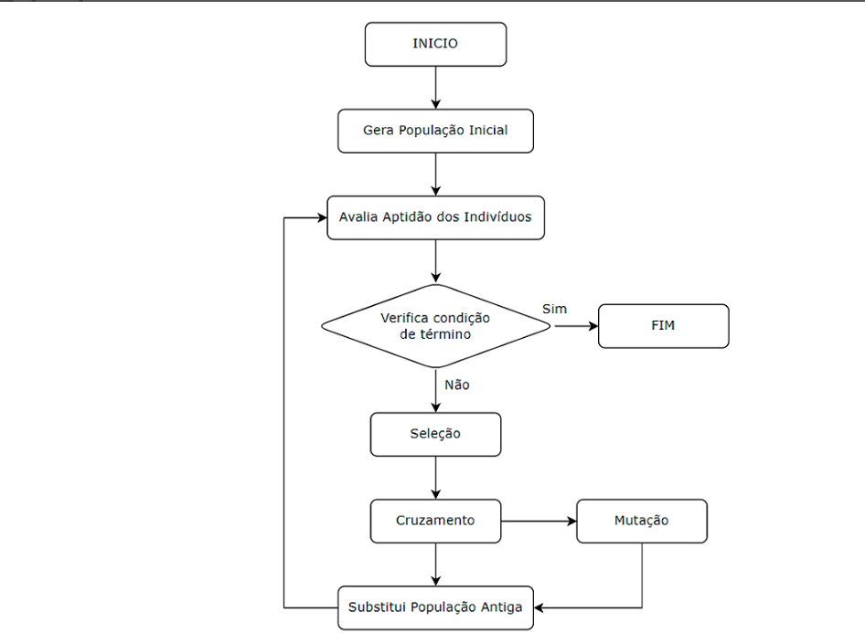

# Tech Challenge - Pós-Tech SOAT - FIAP - Fase 2

Alunos:

* André Mattos - RM358905
* Aurelio Thomasi Jr - RM358104
* Leonardo Ramires - RM358190
* Lucas Arruda - RM358628
* Pedro Marins - RM356883

## Evidências do projeto
- [Link para o repositório](https://github.com/leonardoramires/fiap-ia4devs)
- [Link para o vídeo do projeto]()

## Definição do Problema
O problema consiste em alocar ordens de serviço (OS) de manutenção para operadores de forma otimizada, considerando as habilidades necessárias para cada ordem e as habilidades dos operadores disponíveis. O objetivo é minimizar o tempo de execução das ordens, evitar horas extras desnecessárias e garantir que as ordens sejam atendidas dentro do prazo estipulado.

## Objetivos
Alocar ordens de serviço de forma eficiente, maximizando a compatibilidade entre as habilidades dos operadores e as habilidades necessárias para as ordens.
Minimizar o número de horas extras trabalhadas pelos operadores.
Garantir que as ordens de maior prioridade sejam atendidas dentro do prazo.

## O Projeto

*Figura 1: Fluxograma Genérico do Algoritmo Genético*

Este projeto foi desenvolvido utilizando um algoritmo genético para otimizar a alocação de ordens de serviço aos operadores. Abaixo estão os pontos essenciais da solução:

### 1. Reajuste nas Funções de Aptidão
- ✨ Adição de pesos considerando a prioridade da OS
- 📊 Penalização proporcional por horas extras

### 2. Otimização do Crossover
- 🔄 Garantia de atribuição única para cada ordem
- 📉 Redução de soluções inviáveis

### 3. Processo de Mutação Inteligente
- 🧬 Verificação da qualidade pós-mutação
- ↩️ Reversão automática de mutações prejudiciais

### 4. Sistema de Elitismo
- 🏆 Preservação dos melhores indivíduos
- 📈 Manutenção de soluções de alta qualidade entre gerações

### 5. Gestão Populacional
- 🔄 Reinicialização parcial periódica
- 🎯 Prevenção de convergência prematura para uma solução subótima

### 6. Controle de Qualificação
- ✅ Exigência mínima de 50% das habilidades necessárias
- 🚫 Prevenção de alocações inadequadas

## Detalhamento do Algoritmo Genético

### 1. Geração da População Inicial 🌱

A população inicial consiste em um conjunto de soluções (indivíduos) geradas aleatoriamente, onde cada solução representa uma possível alocação de ordens de serviço ao longo do período de 5 dias.

#### Processo de Geração:
- **Distribuição Aleatória**: As ordens são distribuídas entre operadores e dias
- **Validação de Habilidades**: Garantia de compatibilidade entre operador e ordem
- **Estrutura**: `{dia: {operador_id: [ordem_ids]}}`

### 2. Processo de Seleção 🎯

Utilizamos o método de torneio para selecionar as soluções (pais) que gerarão a próxima geração.

#### Etapas do Torneio:
1. Seleção aleatória de um grupo de soluções
2. Avaliação da aptidão de cada solução
3. Escolha da melhor solução como pai
4. Repetição até atingir o número necessário de pais

### 3. Processo de Crossover 🔄

O crossover combina duas soluções (pais) para gerar uma nova solução (filho).

#### Metodologia:
1. **Seleção do Ponto**: 
   - Escolha aleatória do ponto de divisão
   - Exemplo: Em 5 dias, ponto 2 = dias [1-2] + [3-5]

2. **Combinação**:
   - Primeiro segmento do pai 1
   - Segundo segmento do pai 2
   - Garantia de atribuição única para cada ordem

### 4. Processo de Mutação 🧬

A mutação introduz variações nas soluções para manter a diversidade genética.

#### Procedimento:
1. **Verificação**: Probabilidade de mutação por dia
2. **Execução**: 
   - Seleção de dois operadores no mesmo dia
   - Troca de ordens entre eles
3. **Validação**: 
   - Avaliação pré e pós-mutação
   - Reversão se não houver melhoria

### 5. Função de Aptidão ⚖️

Avalia a qualidade das soluções considerando múltiplos critérios.

#### Critérios de Avaliação:
1. **Compatibilidade de Habilidades**:
   - Pontuação positiva para matches
   - Penalidades para incompatibilidades

2. **Gestão de Prazos**:
   - Verificação de conclusão no prazo
   - Penalidades proporcionais a atrasos e prioridades

3. **Controle de Horas**:
   - Monitoramento de horas por operador
   - Penalização por excesso

### 6. Fluxo do Algoritmo 🔄

1. **Inicialização**:
   - Geração da população inicial

2. **Ciclo Evolutivo**:
   - Cálculo de aptidão
   - Seleção por torneio
   - Crossover
   - Mutação
   - Elitismo
   - Reinicialização parcial periódica

3. **Finalização**:
   - Seleção da melhor solução
   - Conversão para DataFrame

## Informações gerais sobre o resultado do algoritmo

A análise dos resultados do algoritmo genético para alocação de ordens de serviço de manutenção revela aspectos importantes sobre sua performance e limitações. O algoritmo foi desenvolvido para otimizar a distribuição de 100 ordens de serviço entre 15 operadores ao longo de 5 dias, considerando múltiplas variáveis como habilidades técnicas, prioridades e prazos.

### 📊 Resultados Principais

#### 1. Capacidade de Alocação ✅
- O algoritmo conseguiu alocar 100% das ordens de serviço (100 ordens)
- A distribuição contemplou todos os 15 operadores disponíveis
- Houve cobertura dos 5 dias do período analisado

#### 2. Distribuição Temporal 📅
**Concentração nos Primeiros Dias:**
| Dia | Ordens | Horas | % do Total |
|-----|---------|-------|------------|
| 1 | 29 | 142 | 28,3% |
| 2 | 23 | 104 | 20,7% |
| 3 | 23 | 128 | 25,5% |
| 4 | 11 | 62 | 12,4% |
| 5 | 14 | 66 | 13,1% |

#### 3. Gestão de Prioridades ⚡
**Distribuição por Nível:**
| Prioridade | Quantidade | Percentual |
|------------|------------|------------|
| Urgente | 26 | 26% |
| Alta | 28 | 28% |
| Média | 27 | 27% |
| Baixa | 19 | 19% |

#### 4. Compatibilidade de Habilidades 🎯
- A compatibilidade média ficou em 82%
- Foram necessárias adaptações para cobrir todas as ordens

### 🚨 Desafios e Limitações Identificadas

#### 1. Capacidade Operacional
- O volume de trabalho excede significativamente a capacidade da equipe
- A média de horas extras por operador está muito acima do aceitável
- Possível necessidade de redimensionamento da equipe

#### 2. Distribuição Temporal
- Concentração excessiva nos primeiros três dias
- Subutilização da capacidade nos últimos dois dias
- Necessidade de melhor balanceamento da carga de trabalho

#### 3. Gestão de Prioridades
- Atrasos em ordens urgentes indicam necessidade de ajustes no algoritmo
- O sistema de priorização atual pode não estar sendo suficientemente considerado

#### 4. Compatibilidade Técnica
Ausência de matches perfeitos sugere possível necessidade de:
- 📚 Treinamento adicional para a equipe
- 🔄 Revisão dos critérios de matching
- 👥 Possível contratação de especialistas em áreas específicas

### 💡 Recomendações para Melhorias

#### 1. Ajustes no Algoritmo
- Implementar pesos mais significativos para prioridades urgentes
- Melhorar a distribuição temporal das ordens
- Refinar os critérios de matching de habilidades

#### 2. Recursos Humanos
- Avaliar a necessidade de contratações adicionais
- Identificar gaps de habilidades para treinamento
- Considerar a redistribuição de operadores entre turnos

#### 3. Processos
- Revisar os critérios de classificação de prioridades
- Estabelecer limites mais rígidos para horas extras
- Implementar mecanismos de balanceamento de carga

> **Conclusão**: Esta análise demonstra que, embora o algoritmo tenha conseguido alocar todas as ordens, existem oportunidades significativas de melhoria para otimizar a distribuição do trabalho e garantir uma operação mais sustentável e eficiente.

### 1. Estatísticas gerais

| Métrica | Valor |
|---------|-------|
| Total de Ordens | 100 |
| Ordens Alocadas | 100 (100.0%) |
| Ordens Não Alocadas | 0 |

### 2. Análise por prioridade

| Prioridade | Quantidade | Percentual |
|------------|------------|------------|
| Urgente | 26 | 26.0% |
| Alta | 28 | 28.0% |
| Média | 27 | 27.0% |
| Baixa | 19 | 19.0% |

### 3. Análise por operador

| Operador | Ordens Alocadas | Horas Alocadas | Capacidade | % Utilização |
|----------|-----------------|----------------|------------|--------------|
| op1 | 10 | 57.0h | 7.0h | 814.3% |
| op2 | 6 | 32.0h | 8.0h | 400.0% |
| op3 | 5 | 28.0h | 7.0h | 400.0% |
| op4 | 7 | 28.0h | 9.0h | 311.1% |
| op5 | 9 | 37.0h | 9.0h | 411.1% |
| op6 | 9 | 43.0h | 8.0h | 537.5% |
| op7 | 5 | 26.0h | 7.0h | 371.4% |
| op8 | 6 | 29.0h | 7.0h | 414.3% |
| op9 | 10 | 43.0h | 7.0h | 614.3% |
| op10 | 10 | 50.0h | 7.0h | 714.3% |
| op11 | 5 | 32.0h | 8.0h | 400.0% |
| op13 | 6 | 34.0h | 7.0h | 485.7% |
| op14 | 5 | 23.0h | 7.0h | 328.6% |
| op15 | 4 | 22.0h | 7.0h | 314.3% |
| op12 | 3 | 18.0h | 8.0h | 225.0% |

### 4. Análise de prazos

| Métrica | Valor |
|---------|-------|
| Ordens no Prazo | 65 (65.0%) |

## Detalhamento dos Atrasos

| Ordem | Dias de Atraso | Prioridade |
|-------|----------------|------------|
| ordem40 | 1 | urgente |
| ordem63 | 1 | alta |
| ordem92 | 1 | urgente |
| ordem62 | 1 | urgente |
| ordem12 | 1 | alta |
| ordem70 | 1 | urgente |
| ordem48 | 1 | média |
| ordem38 | 1 | urgente |
| ordem95 | 2 | média |
| ordem24 | 2 | média |
| ordem44 | 1 | baixa |
| ordem90 | 2 | baixa |
| ordem61 | 2 | alta |
| ordem46 | 2 | urgente |
| ordem67 | 2 | média |
| ordem49 | 1 | alta |
| ordem78 | 3 | alta |
| ordem29 | 2 | média |
| ordem1 | 1 | média |
| ordem80 | 1 | urgente |
| ordem5 | 3 | alta |
| ordem39 | 2 | média |
| ordem59 | 3 | baixa |
| ordem42 | 3 | baixa |
| ordem76 | 2 | baixa |
| ordem65 | 1 | alta |
| ordem15 | 2 | baixa |
| ordem57 | 1 | alta |
| ordem100 | 1 | baixa |
| ordem21 | 2 | urgente |
| ordem3 | 1 | urgente |
| ordem81 | 4 | média |
| ordem51 | 4 | alta |
| ordem9 | 2 | média |
| ordem79 | 2 | alta |

### 5. Análise de compatibilidade

| Métrica | Valor |
|---------|-------|
| Matches Perfeitos | 0 (0.0%) |
| Compatibilidade Média | 8200.0% |

### 6. Distribuição por dia

#### Dia 1
| Métrica | Valor |
|---------|-------|
| Total de Ordens | 29 |
| Horas Alocadas | 142.0h |

**Distribuição de Prioridades:**
- Urgente: 8
- Alta: 7
- Média: 7
- Baixa: 7

#### Dia 2
| Métrica | Valor |
|---------|-------|
| Total de Ordens | 23 |
| Horas Alocadas | 104.0h |

**Distribuição de Prioridades:**
- Urgente: 9
- Alta: 8
- Média: 5
- Baixa: 1

#### Dia 3
| Métrica | Valor |
|---------|-------|
| Total de Ordens | 23 |
| Horas Alocadas | 128.0h |

**Distribuição de Prioridades:**
- Urgente: 5
- Alta: 5
- Média: 8
- Baixa: 5

#### Dia 4
| Métrica | Valor |
|---------|-------|
| Total de Ordens | 11 |
| Horas Alocadas | 62.0h |

**Distribuição de Prioridades:**
- Urgente: 2
- Alta: 3
- Média: 4
- Baixa: 2

#### Dia 5
| Métrica | Valor |
|---------|-------|
| Total de Ordens | 14 |
| Horas Alocadas | 66.0h |

**Distribuição de Prioridades:**
- Urgente: 2
- Alta: 5
- Média: 3
- Baixa: 4

---

### Dados dos operadores

---

| operator_id | skills | level | shift | hours_per_day |
|------------|--------|-------|-------|---------------|
| op1 | alvenaria \| pintura | sênior | manhã | 7 |
| op2 | solda \| alvenaria | pleno | noite | 8 |
| op3 | solda \| pintura | sênior | noite | 7 |
| op4 | pintura \| alvenaria | sênior | tarde | 9 |
| op5 | alvenaria \| elétrica \| solda | júnior | noite | 9 |
| op6 | hidráulica \| pintura \| alvenaria | júnior | noite | 8 |
| op7 | alvenaria \| hidráulica \| solda | sênior | manhã | 7 |
| op8 | alvenaria \| pintura | sênior | tarde | 7 |
| op9 | solda \| elétrica | sênior | manhã | 7 |
| op10 | hidráulica \| elétrica \| alvenaria | pleno | manhã | 7 |
| op11 | alvenaria \| pintura | júnior | noite | 8 |
| op12 | alvenaria \| hidráulica | júnior | tarde | 8 |
| op13 | elétrica \| pintura | especialista | manhã | 7 |
| op14 | alvenaria \| solda \| pintura | sênior | tarde | 7 |
| op15 | alvenaria \| pintura | júnior | noite | 7 |

### Dados das ordens

| order_id | required_skills | estimated_hours | priority | expected_start_day |
|----------|----------------|-----------------|----------|-------------------|
| ordem1 | alvenaria | 2 | média | 3 |
| ordem2 | solda \| pintura | 7 | urgente | 4 |
| ordem3 | solda | 6 | urgente | 4 |
| ordem4 | elétrica | 2 | média | 4 |
| ordem5 | elétrica | 2 | alta | 1 |
| ... | ... | ... | ... | ... |
| ordem96 | pintura \| solda | 8 | alta | 4 |
| ordem97 | pintura \| alvenaria | 6 | urgente | 4 |
| ordem98 | alvenaria \| solda | 4 | alta | 2 |
| ordem99 | pintura \| alvenaria | 4 | baixa | 5 |
| ordem100 | hidráulica | 7 | baixa | 4 |

[100 rows x 5 columns]

### Dados das ordens atribuídas aos operdores (shape = (100, 16))

| dia | id_operador | id_ordem | habilidades_ordem | habilidades_nao_atendidas | compatibilidade_nivel_prioridade | hora_extra | total_hora_extra |
|-----|-------------|----------|-------------------|---------------------------|----------------------------------|------------|------------------|
| 3 | op1 | ordem2 | solda \| pintura | solda | OK | Não | 0 |
| 2 | op1 | ordem26 | pintura \| alvenaria | | OK | Sim | 1 |
| 5 | op1 | ordem42 | pintura | | OK | Não | 0 |
| 2 | op1 | ordem47 | alvenaria \| hidráulica | hidráulica | OK | Sim | 5 |
| 3 | op1 | ordem48 | alvenaria | | OK | Sim | 7 |
| ... | ... | ... | ... | ... | ... | ... | ... |
| 5 | op9 | ordem3 | solda | | OK | Não | 0 |
| 3 | op9 | ordem58 | elétrica | | OK | Sim | 2 |
| 5 | op9 | ordem81 | alvenaria \| solda | alvenaria | OK | Sim | 1 |
| 3 | op9 | ordem88 | elétrica | | OK | Sim | 6 |
| 4 | op9 | ordem93 | solda | | OK | Não | 0 |
